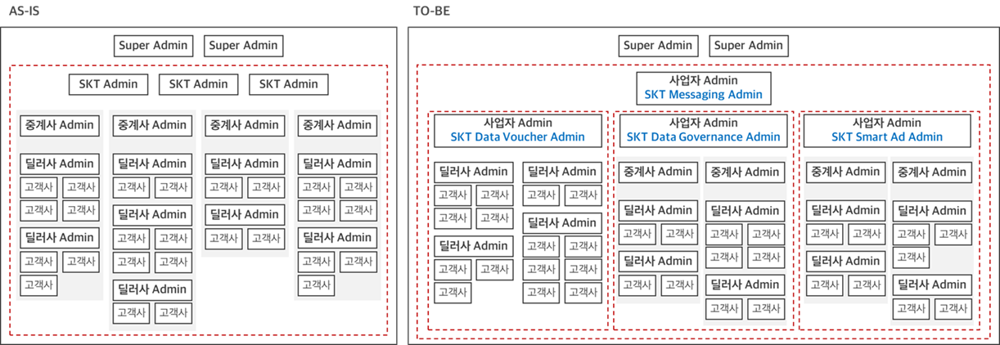
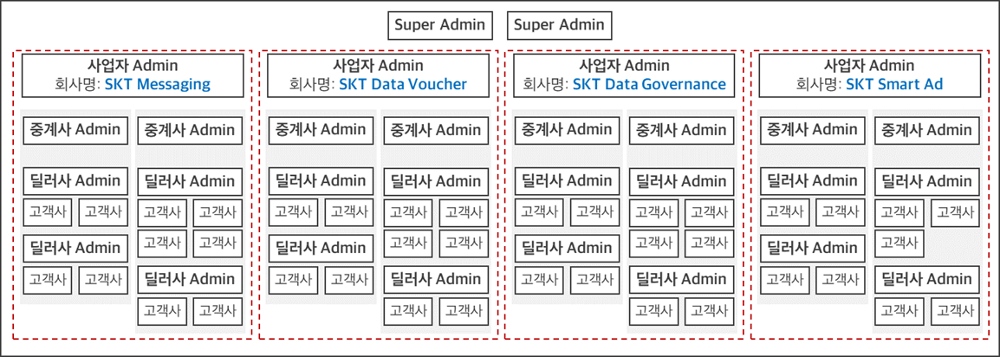

# 20201207
## Q
SKT Admin 권한 관련해서 검토하다가 문의사항이 있어서 연락 드립니다.
SKT Admin이 매핑된 중계사 및 관련 딜러사, 고객사의 정보만 조회하도록
변경하면

1. SKT Admin 끼리 구분하는 방식이 필요합니다.
A. 1안: 관리자 승인/등록 시 SKT Admin의 “회사명” 입력 필드에
“회사+부서/팀 명”을 입력하여
SKT Admin 관리자를 “회사명” 기준으로 구분됩니다.

B. 2안: 관리자 승인/등록 시 SKT Admin의 “부서명” 입력 필드(NEW)에
Dropdown 또는 직적 입력하여
SKT Admin 관리자를 “부서명” 기준으로 구분됩니다.

2. SKT Admin이 중계사와 매핑하는 기준이 필요합니다.
A. 1안: 중계사 등록 시 매핑할 SKT Admin 부서/팀 같이 등록
* 이슈: 현재 중계사 등록/관리 화면이 없음 → Backend로 등록/관리 필요
B. 2안: SKT Admin 등록/승인 시 볼 조회 가능할 중계사 선택 (체크박스)
* 이슈: 중계사가 많은 경우 찾기 힘들 수 있음 → 중계사가 10개 이하 인
경우만 추천
* 2안을 사용할 경우 SKT Admin 구분을 위한 “회사명” OR “부서명”
필요 없음

## Reply
기존 SKT Admin은 SuperAdmin과 거의 동일한 권한을 가지고 있었습니다만… 앞으로는 개념을 바꾸셔야 할 것으로 보입니다.
아래 내용 참고하시기 바랍니다.
1. 모든 Admin User는 중계사와 딜러사를 DB 작업으로 매핑할 수 있습니다. SKT Admin도 마찬가지 입니다. 물론 DB 수작업으로 매핑합니다.
2. SKT Admin 중에 중계사 정보가 매핑된 Admin은 해당 중계사에 소속된 모든 사용자의 설문을 승인/조회 할 수 있다.
3. SKT Admin 중에 중계사 정보 및 딜러사 정보까지 매핑된 Admin은 해당 딜러사에 소속된 모든 사용자의 설문을 승인/조회 할 수 있다.
4. SKT Admin 중에서 중계사나 딜러사가 매핑된 Admin은 자신의 관할이 아닌 타 고객의 설문을 승인/조회할 수 없다.
5. 결과적으로 SKT Admin은 기존 상담비즈챗의 중계사나 딜러사 Admin과 비슷한 권한범위를 가지는 마케팅비즈챗의 중계사/딜러사 Admin 이다.

## Reply
현재 비즈챗 전체를 들여다 볼 수 있는 SKT admin 은 이제 없어집니다.
새롭게 ‘사업자 admin’ 이 생기는데 사업자 admin 중의 하나일 뿐이죠.

예정대로 라면 내년에는 총4개의 사업자 admin 이 존재 할 것 같습니다.
1. 기존의 SKT admin -> SKT Messaging admin 으로 바꿔야 안 헷갈리겠네요.
2. SKT Data voucher admin
3. SKT Data Governace admin
4. SKP Samrt Ad admin(신규사업)
(2, 3, 4번이 새로 생김, 사업자 admin은  다른 사업자의 데이터 접근 못함, 자기 하위의 중계사, 딜러사, 고객사 data만 접근 가능)

1번은 현재 중계사 딜러사 구조를 유지
2번은 SKT 고객만을 대상으로 하므로 중계사는 없음
3번, 4번은 이통 3사 고객을 대상으로 하므로 중계사(인포뱅크) 필요

@앤젤라
사업자 admin 및 계정 생성, 중계사 매핑은 모두 수동으로 진행해야 할 것 같습니다.
같은 중계사가 여러 사업자에 걸쳐 있을 수도 있으니 그걸 또 사업자별로 구분해야 하고요.

## Reply
말씀하신 내용을 아래와 같이 이해하면 맞는지 확인 부탁 드립니다.
1. 관리자 권한 변경에 대한 개념도

Admin 사이트에 “메시지 관리 & 통계”, “고객사 관리”, “과금 현황”, 및 “서비스 관리” 메뉴에
i. SKT Messaging Admin: 모든 중계사/딜러사/고객사가 data 접근 가능
ii. SKT Data Voucher Admin: 본인 계정과 매핑된 딜러사/고객사가 data만 접근 가능
iii. SKT Data Governance Admin 및 SKT Smart Ad Admin: 본인 계정과 매핑된
중계사/딜러사/고객사가 data만 접근 가능

2. 사업자 Admin 및 계정 생성, 중계사 매핑은 모두 수동으로 진행해야 한다고 하셨으며
i. Admin 사이트의 “관리자 관리” 메뉴에 “아이디 유형” 보완 (SKT Admin → 사업자 Admin)
단, 사업자 Admin의 유형 (SKT Messaging Admin/SKT Data Voucher Admin/SKT Data
Governance Admin/SKT Smart Ad Admin)은 Back단에서 수동으로 관리
ii. 각 사업자 Admin과 매핑할 중계사, 딜러사, 고객사 리스트가 필요하며
새로운 중계사/딜러사/고객사가 등록될 때마다 매핑 가능할 사업자 Admin 계정도 같이 공유하기 필요해 보입니다.

## Reply
아래 정리하신 내용에 아래 것들이 가능하다면 반영되었으면 좋겠습니다.
1.     사업자 Admin의 유형 (SKT Messaging Admin/SKT Data Voucher Admin/SKT Data Governance Admin/SKP Smart Ad Admin) 존재를 특정하지 않았으면 합니다.
è  사업자 보다는 마케팅비즈챗 딜러사/중계사가 더 적합하다는 생각입니다.
è  기존 상담비즈챗의 경우, CID를 획득하여 실제 전송료를 부담하는 사업자는 중계사, 중계사를 통해 전송하면 딜러사 역할을 하는 구조 이었습니다.
è  마케팅 비즈챗은 현재 모든 고객사가 SKT(중계사)를 통해 전송하고 있습니다. SKT 메시징사업팀은 지금까지 딜러사가 없는 중계사(SKT) 역할을 했습니다.
è  SKT의 다른 부서들에서 기존 메시징사업팀의 CID를 같이 사용한다면, SKT 메시징사업팀은 중계사가 아닌 딜러사로 내려오면 됩니다. SKT 중계사는 존재하되 중계사 Admin 없이 운영하는 형태입니다.
è  SKT 다른 부서들이 모두 별도의 다른 CID를 사용한다면 각자 중계사 Admin역할을 지금처럼 수행하면 됩니다. 언제나 고객사는 하나의 중계사에만 바인딩 가능합니다.
è  SKP가 자체 메시지 발송사업을 진행하려면 인포뱅크 등과 같은 제3의 회사와 계약하여 메시지 발송 CID를 확보하고, 중계사 역할을 수행하며, 아래 딜러사나 고객사를 모집하면 됩니다.
è  마케팅비즈챗과 상담비즈챗은 연관성이 없는 별도 상품입니다. 중계사를 지정할 때, 상담비즈챗인지 아니면 문비즈챗인지 하나로 정해서, 해당 중계사에 연결된 Admin 고객이나 고객사가 Web에 로그인하면, 상담/마케팅 중 하나만 볼 수 있었으면 좋겠습니다. Super Admin만 예외입니다.

## Reply 20201208
유찬석 매니저님께서, CID 매핑 때문에 중계사가 반드시 추가 되어야 한다고 해서 다시 정정 합니다.
모든 사업자들에 중계사가 포함되도록 해주시고
SKT Messaging admin 에 매핑된 중계사를 SKT 라고 할 때
SKT Data Voucher admin 에서는 SKT1 이라는 중계사를 새로 매핑(신규 CID로)해야 할 것 같네요.

@앤젤라
사업자 admin 유형을 따로 관리 할 필요는 없습니다.(현재 중계사 admin 계정처럼 운영)
사업자명을 SKT Messaging, SKT Data Voucher, SKT Data Governance, SKP Obiz 등으로 입력해 놓으면 될 것 같습니다.
i.   각 사업자 Admin과 매핑할 중계사, 딜러사, 고객사 리스트가 필요하며
->필요시에 수동 등록합니다.

## Reply 20201208 (정리)
말씀 하신 내용을 아래와 같이 정리하여 화면설계서 및 기능정의서에 반영하도록 하겠습니다.

사업자 Admin
“회사명” 기준으로 구분 (SKT Messaging, SKT Data Voucher, SKT Data Governance, SKT Smart Ad)
즉, 현 “관리자 관리” 메뉴의 화면 레이아웃이 변경 없음
사업자 Admin 계정이 접근 가능한 중계사/딜러사/고객사를 수동 매핑 (유찬석 매니저님이 추후 필요 시 작업 예정)
사업자 Admin 계정이 “메시지 관리 & 통계”, “고객사 관리”, “과금 현황”, 및 “서비스 관리” 메뉴에 매핑된 중계사/딜러사/고객사의 data만 접근 가능
TO-BE Admin 권한 개념도:

# Redmine
## Task 2098 